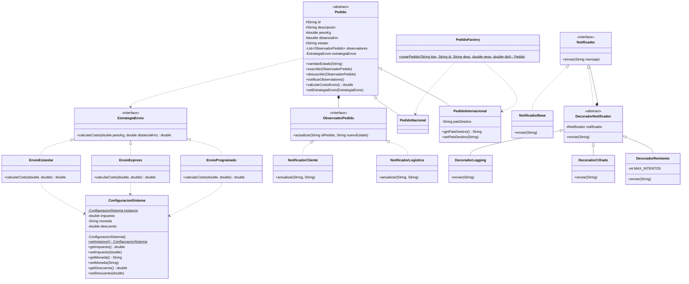

# Sistema de Entregas a Domicilio

Sistema en Java que monitorea pedidos en tiempo real, aplica distintas estrategias de cálculo de envío, notifica automáticamente a los interesados y extiende las notificaciones de forma dinámica. Implementa cinco patrones de diseño: **Singleton, Strategy, Factory, Observer y Decorator**.

---

## Diagrama de clases UML



---

## Estructura de carpetas

```
src/
  singleton/
    ConfiguracionSistema.java
  strategy/
    EstrategiaEnvio.java
    EnvioEstandar.java
    EnvioExpress.java
    EnvioProgramado.java
  factory/
    Pedido.java
    PedidoNacional.java
    PedidoInternacional.java
    PedidoFactory.java
  observer/
    ObservadorPedido.java
    NotificadorCliente.java
    NotificadorLogistica.java
  decorator/
    Notificador.java
    NotificadorBase.java
    DecoradorNotificador.java
    DecoradorLogging.java
    DecoradorCifrado.java
    DecoradorReintento.java
  Main.java
README.md
```

---

## Compilar y ejecutar

Desde la raíz del repositorio:

```bash
# 1. Compilar
javac -d out src/singleton/ConfiguracionSistema.java \
             src/strategy/EstrategiaEnvio.java \
             src/strategy/EnvioEstandar.java \
             src/strategy/EnvioExpress.java \
             src/strategy/EnvioProgramado.java \
             src/observer/ObservadorPedido.java \
             src/observer/NotificadorCliente.java \
             src/observer/NotificadorLogistica.java \
             src/decorator/Notificador.java \
             src/decorator/NotificadorBase.java \
             src/decorator/DecoradorNotificador.java \
             src/decorator/DecoradorLogging.java \
             src/decorator/DecoradorCifrado.java \
             src/decorator/DecoradorReintento.java \
             src/factory/Pedido.java \
             src/factory/PedidoNacional.java \
             src/factory/PedidoInternacional.java \
             src/factory/PedidoFactory.java \
             src/Main.java

# 2. Ejecutar
java -cp out Main
```

---

## Salida esperada en consola

```
=== CONFIGURACION DEL SISTEMA ===
Impuesto : 0.19
Moneda   : COP
Descuento: 0.05

=== CREACION DE PEDIDOS ===
Creado: PedidoNacional{id='P001', descripcion='Electrodomestico', pesoKg=5.0, distanciaKm=100.0, estado='creado'}
Creado: PedidoInternacional{id='P002', descripcion='Repuesto automotriz', pesoKg=2.5, distanciaKm=3000.0, estado='creado', paisDestino='Por definir'}

=== SUSCRIPCION DE OBSERVADORES ===
Observadores suscritos al pedido P001

=== CALCULO DE COSTO DE ENVIO ===
Costo Estandar  : 11900.00 COP
Costo Express   : 23800.00 COP
Costo Programado: 9044.00 COP

=== CAMBIOS DE ESTADO DEL PEDIDO NACIONAL ===
[CLIENTE] Pedido P001: estado actualizado a 'en preparación'
[LOGISTICA] Pedido P001: requiere acción para estado 'en preparación'
[CLIENTE] Pedido P001: estado actualizado a 'enviado'
[LOGISTICA] Pedido P001: requiere acción para estado 'enviado'
[CLIENTE] Pedido P001: estado actualizado a 'entregado'
[LOGISTICA] Pedido P001: requiere acción para estado 'entregado'

=== NOTIFICADOR DECORADO (Logging + Cifrado) ===
[LOG] Enviando notificación: Pedido P001 entregado exitosamente
[NOTIFICACION] UGVkaWRvIFAwMDEgZW50cmVnYWRvIGV4aXRvc2FtZW50ZQ==
```

> El mensaje cifrado es la codificación en Base64 de `Pedido P001 entregado exitosamente`.
